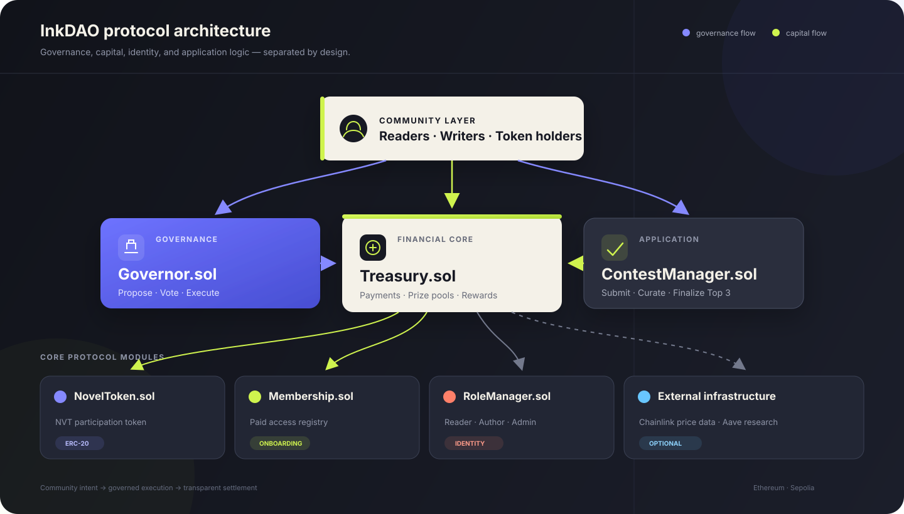

# InkDAO

### Decentralized publishing and community governance on Ethereum

InkDAO is a full-stack FinTech and Web3 project for community-owned publishing.
Writers submit work, readers curate with NVT, and DAO governance coordinates
prize pools and Treasury execution through six modular smart contracts.

**Live Demo:** [Open the InkDAO application](https://irenezhangtt.github.io/memeDAO/)

**Core Stack:** Ethereum Sepolia · Solidity 0.8.x · JavaScript ES6+ · React 18 · ethers.js 6

**Validated Scope:** 6 smart contracts · 3 participant roles · 11 gas benchmarks · end-to-end Sepolia workflow

---

## Table of contents

- [Project overview](#project-overview)
- [Core features](#core-features)
- [System architecture](#system-architecture)
- [Smart contracts](#smart-contracts)
- [Application guide](#application-guide)
- [Protocol workflows](#protocol-workflows)
- [Token and treasury model](#token--treasury-model)
- [Getting started](#getting-started)
- [Deployment](#deployment)
- [Testing and validation](#testing--validation)
- [Security](#security)
- [Roadmap](#roadmap)

## Project overview

Traditional publishing platforms centralize discovery, ranking, monetization,
and editorial control. InkDAO tests a different market structure:

> **Writers create · Readers curate · The community governs · The protocol settles**

Readers join the protocol and receive `NVT` participation tokens. Authors submit
works to time-bound contests. Readers commit NVT to the entries they support,
and the protocol finalizes the Top 3. Shared capital is held in a transparent
Treasury and distributed through governed execution.

### At a glance

| Protocol primitive | What it does | Why it matters |
|---|---|---|
| **Programmable membership** | Converts participation fees into access, roles, and NVT | Creates a transparent onboarding path |
| **Tokenized curation** | Uses weighted, non-reusable contest votes | Makes reader conviction measurable |
| **Creator prize pools** | Accumulates membership and submission fees | Connects platform activity to creator rewards |
| **DAO governance** | Coordinates proposals, voting, and execution | Makes treasury decisions publicly auditable |

> InkDAO is a research prototype deployed and tested on Ethereum Sepolia. It is
> not a production financial product and its contracts have not been audited.

## Core features

### 1. Membership and identity

- Reader onboarding through paid membership
- Reader, author, and administrator roles
- Controlled role grants and revocations
- Wallet-native identity through an EIP-1193 provider

### 2. Novel contests

- Time-bound writing competitions
- Title and IPFS-compatible content URI submissions
- NVT-weighted community voting
- Deterministic Top 3 finalization
- On-chain contest and submission records

### 3. Governance

- Proposal creation with configurable thresholds
- Community voting with quorum checks
- Proposal lifecycle and execution tracking
- Governed calls into Treasury and ContestManager

### 4. Treasury and rewards

- Membership, token-purchase, and submission revenue
- Transparent contest prize pools
- Governed creator reward settlement
- Platform reserve accounting
- Chainlink pricing and Aave allocation research

### 5. Full-stack Web3 interface

- Responsive protocol dashboard
- MetaMask connection and network detection
- Contract reads and transaction preparation through ethers.js
- Dedicated views for membership, contests, governance, Treasury, and tests

## System architecture

InkDAO separates community access, governed execution, financial operations,
and application logic across six purpose-built contracts.

<p align="center">
  
</p>

### Component relationships

| From | Relationship | To |
|---|---|---|
| Readers and writers | Join, submit, and commit NVT | Membership / ContestManager |
| Community voters | Propose and vote | Governor |
| Governor | Executes approved actions | ContestManager / Treasury |
| Treasury | Mints participation assets and pays rewards | NovelToken / recipients |
| Treasury | Reads reference price data | Chainlink ETH/USD |
| Treasury | Explores governed idle-capital routing | Aave |
| Frontend | Reads state and prepares transactions | All protocol contracts |

### Technical differentiators

<table>
  <tr>
    <td width="33%" valign="top"><b>01 · Modular contracts</b><br /><sub>Identity, governance, curation, and capital operations remain separate and auditable.</sub></td>
    <td width="33%" valign="top"><b>02 · Burn-to-vote curation</b><br /><sub>Committed NVT cannot be recycled across contest votes, making conviction economically legible.</sub></td>
    <td width="33%" valign="top"><b>03 · Governed execution</b><br /><sub>Thresholds, quorum, voting windows, and execution connect decisions to traceable calls.</sub></td>
  </tr>
  <tr>
    <td width="33%" valign="top"><b>04 · Oracle pricing</b><br /><sub>ETH/USD reference data supports human-readable fee targets with Ethereum settlement.</sub></td>
    <td width="33%" valign="top"><b>05 · Programmable Treasury</b><br /><sub>Prize pools, reserves, rewards, and optional DeFi routing are inspectable.</sub></td>
    <td width="33%" valign="top"><b>06 · Hybrid data model</b><br /><sub>Content stays off-chain while roles, rankings, voting, and settlement remain on-chain.</sub></td>
  </tr>
</table>

## Smart contracts

### Core contracts

| Contract | Purpose | Main capabilities |
|---|---|---|
| [`NovelToken.sol`](./contracts/NovelToken.sol) | ERC-20 participation asset | Authorized minting, approvals, transfers, user burns |
| [`Membership.sol`](./contracts/Membership.sol) | Paid access registry | Membership checks, grants, revocations |
| [`RoleManager.sol`](./contracts/RoleManager.sol) | Protocol identity | Reader, author, administrator permissions |
| [`ContestManager.sol`](./contracts/ContestManager.sol) | Publishing competitions | Create, submit, vote, close, finalize Top 3 |
| [`Treasury.sol`](./contracts/Treasury.sol) | Protocol finance | Payments, pricing, prize pools, rewards |
| [`Governor.sol`](./contracts/Governor.sol) | DAO coordination | Propose, vote, quorum, finalize, execute |

### Key contract calls

| Flow | Functions |
|---|---|
| Onboarding | `purchaseMembership()`, `registerAsAuthor()` |
| Participation | `buyExtraTokens()`, `approve()` |
| Contest | `createContest()`, `submitNovel()`, `vote()`, `finalizeWinner()` |
| Governance | `propose()`, `vote()`, `finalizeProposal()`, `execute()` |
| Treasury research | `getEthUsdPrice()`, `supplyIdleEthToAave()` |

## Application guide

The public interface is organized into six areas:

| Area | What users can do |
|---|---|
| **Overview** | Review protocol metrics, active contest, and reader leaderboard |
| **Membership** | Connect a wallet and explore reader-to-author onboarding |
| **Novel Contest** | Discover entries, submit work, and inspect NVT voting |
| **Governance** | Review proposal creation, voting, quorum, and execution |
| **Treasury** | Inspect revenue, prize pools, reserves, oracle, and DeFi research |
| **Test Report** | Review Sepolia evidence, gas benchmarks, and findings |

### Quick interface flow

1. Open the [InkDAO application](https://irenezhangtt.github.io/memeDAO/).
2. Select **Connect Wallet**.
3. Approve the MetaMask connection.
4. Switch to Ethereum Sepolia when prompted.
5. Explore the six protocol areas from the main navigation.

The current public build is suitable for demonstrating the complete product
structure. Live contract writes require valid environment addresses and active
Sepolia deployments.

## Protocol workflows

### End-to-end publishing lifecycle

```text
Join InkDAO
    ↓
Receive NVT and reader access
    ↓
Register as an author
    ↓
Submit title + content URI
    ↓
Readers approve and commit NVT
    ↓
Contest closes and Top 3 finalize
    ↓
Governance approves distribution
    ↓
Treasury settles creator rewards
```

### Governance lifecycle

```text
Proposal → Voting → Quorum check → Finalization → Execution
```

1. An eligible participant submits a proposal and encoded target call.
2. Community members vote during the configured voting window.
3. The Governor checks support and quorum.
4. A successful proposal is finalized.
5. The approved action executes against Treasury or ContestManager.

### Contest lifecycle

1. Create a time-bound contest.
2. Authors submit a title and off-chain content reference.
3. Readers approve NVT for the ContestManager.
4. Readers commit weighted votes; committed NVT is burned.
5. Voting closes and the Top 3 are finalized.
6. Governance authorizes the associated reward settlement.

## Token & treasury model

### NVT utility

`NVT` is the protocol participation token used for:

- contest voting power;
- governance participation;
- auditable reader conviction;
- burn-based contest voting that prevents token reuse.

NVT does not represent equity, debt, ownership, profit rights, or a guaranteed
financial return.

### Capital flow

```text
Membership fees + NVT purchases + submission fees
                         │
                         ▼
                Treasury / Prize Pool
                         │
                  DAO governance
                         │
              ┌──────────┴──────────┐
              ▼                     ▼
       Top-three writers      Protocol reserve
```

Chainlink price data was used to research USD-denominated fee inputs. Aave was
explored as an optional idle-Treasury strategy. Both integrations remain
prototype research rather than production yield infrastructure.

## Getting started

### Prerequisites

- Node.js 20 or newer
- npm
- MetaMask or another EIP-1193 wallet
- Sepolia ETH for test transactions

### Installation

```bash
git clone https://github.com/Irenezhangtt/memeDAO.git
cd memeDAO
npm install
cp .env.example .env
npm start
```

Open `http://localhost:3000`.

### Environment configuration

```env
REACT_APP_CONTEST_MANAGER_ADDRESS=
REACT_APP_MEMBERSHIP_ADDRESS=
REACT_APP_NOVEL_TOKEN_ADDRESS=
REACT_APP_ROLE_MANAGER_ADDRESS=
REACT_APP_TREASURY_ADDRESS=
REACT_APP_GOVERNOR_ADDRESS=
```

These values are public contract addresses. Never put a private key, seed
phrase, privileged RPC secret, or deployer credential in a React environment
variable.

### Technology stack

| Layer | Stack | Engineering role |
|---|---|---|
| **Settlement** | Ethereum / Sepolia | Immutable state and transaction settlement |
| **Contracts** | Solidity, OpenZeppelin | Protocol logic and access control |
| **Wallet** | MetaMask, EIP-1193 | Identity, signatures, transaction requests |
| **Application** | JavaScript ES6+, React 18, ethers.js 6 | Responsive UI and contract interaction |
| **Oracle research** | Chainlink ETH/USD | Reference pricing |
| **Treasury research** | Aave | Optional governed capital routing |
| **Content** | IPFS-compatible URIs | Content-addressed publication references |
| **Hosting** | GitHub Pages | Public frontend delivery |

## Deployment

### Frontend build

```bash
npm run build
```

### GitHub Pages

```bash
npm run deploy:pages
```

### Contract deployment order

1. Deploy `NovelToken`, `Membership`, and `RoleManager`.
2. Deploy `ContestManager` and `Treasury` with their dependencies.
3. Deploy `Governor`.
4. Assign Treasury manager and token-minter permissions.
5. Connect Governor, Treasury, and ContestManager.
6. Record network-specific addresses in `.env`.
7. Complete a multi-wallet test before publishing the addresses.

## Testing & validation

The full workflow was exercised on Ethereum Sepolia with multiple wallets. The
test covered deployment, permissions, membership, author registration,
submissions, approvals, voting, winner selection, governance, and rewards.

### Gas benchmarks

| Function | Contract | Gas used |
|---|---|---:|
| `createContest()` | ContestManager | 127,263 |
| `submitNovel()` | ContestManager | 263,118 |
| `vote()` | ContestManager | 97,227 |
| `finalizeWinner()` | ContestManager | 98,859 |
| `registerAsAuthor()` | Treasury | 65,959 |
| `purchaseMembership()` | Treasury | 166,188 |
| `buyExtraTokens()` | Treasury | 88,289 |
| `supplyIdleEthToAave()` | Treasury | 235,366 |
| `propose()` | Governor | 235,233 |
| `vote()` | Governor | 94,349 |
| `execute()` | Governor | 321,822 |

Governance execution was the most expensive measured operation because it
combines state changes with an external contract call.

### Observed Sepolia fees

| Action | Transaction fee |
|---|---:|
| Purchase membership | 0.00024928 ETH |
| Register as author | 0.00009893 ETH |
| Submit novel | 0.00039467 ETH |
| Vote for novel | 0.00014583 ETH |
| Finalize winner | 0.00014828 ETH |
| Propose reward distribution | 0.00035284 ETH |
| Vote on reward distribution | 0.00014152 ETH |
| Execute reward distribution | 0.00048273 ETH |

Sepolia ETH has no production value. These are historical test observations,
not current testnet or mainnet cost estimates.

### Sepolia contract archive

| Contract | Address |
|---|---|
| NovelToken | [`0x4f74...fCa0`](https://sepolia.etherscan.io/address/0x4f74E67b0966CafD478ADEe7Ce42C6fE72f8fCa0) |
| Membership | [`0xf580...bE37`](https://sepolia.etherscan.io/address/0xf580DB362F1650Ec87e76cB64a01D17ca84ebE37) |
| RoleManager | [`0xF6Fe...61C2`](https://sepolia.etherscan.io/address/0xF6FeA9b3147dA656C6397C4408eEFd24E1E961C2) |
| ContestManager | [`0xD272...8542`](https://sepolia.etherscan.io/address/0xD272f160B616C43E4084c045EDE7f477aaeb8542) |
| Treasury | [`0xcD3f...5dA8`](https://sepolia.etherscan.io/address/0xcD3f2f5438562735a792d17Fe1bD8205963D5dA8) |
| Governor | [`0xeB9A...9895`](https://sepolia.etherscan.io/address/0xeB9Af9D5A924d9F90D424832C6F0783C82a69895) |

These addresses are a public test archive and should not be assumed to remain
active.

## Security

InkDAO is research software. The contracts have **not** been independently
audited and should not custody production funds.

Production hardening requires:

- snapshot-based `ERC20Votes`;
- Timelock-controlled execution;
- multisig or governance control instead of broad owner privileges;
- reentrancy protection and pull-based rewards where applicable;
- Chainlink feed freshness and decimals validation;
- strict caps and controls for external lending;
- invariant, fuzz, access-control, and fork tests;
- bounded or redesigned winner selection;
- independent contract audit and legal review.

See [`SECURITY.md`](./SECURITY.md) for the security policy.

## Roadmap

- [x] Six-contract modular protocol
- [x] Membership and role-based participation
- [x] Token-weighted novel contests and Top 3 finalization
- [x] Treasury-funded rewards and DAO execution
- [x] Sepolia multi-wallet validation
- [x] Chainlink and Aave integration research
- [x] Public responsive Web3 application
- [ ] ERC20Votes and Timelock governance upgrade
- [ ] IPFS upload and retrieval
- [ ] Automated Hardhat test suite
- [ ] Gas regression, invariant, fuzz, and fork testing
- [ ] Multisig-controlled deployment
- [ ] Independent security audit

## Repository structure

```text
.
├── contracts/          Solidity protocol contracts
├── docs/               Architecture assets
├── public/             Static web assets and social preview
├── src/
│   ├── abi/            Contract ABIs
│   ├── components/     Product and Web3 interface components
│   └── utils/          Contract clients and formatting helpers
├── .env.example        Public contract-address template
├── SECURITY.md         Security and disclosure guidance
└── README.md           Protocol documentation
```

## Research team

InkDAO was created as a full-stack blockchain and cryptocurrency research
project by **Jiaying Xie** and **Yutong Zhang**.

## Disclaimer

InkDAO is experimental software for research, education, and demonstration. It
is not financial, investment, legal, or tax advice. NVT has no guaranteed value,
return, liquidity, or redemption right. Smart-contract interactions can result
in permanent loss.

---

<div align="center">

**InkDAO — writers create, readers decide, the protocol settles.**

[Launch App](https://irenezhangtt.github.io/memeDAO/) ·
[View Source](https://github.com/Irenezhangtt/memeDAO)

</div>
